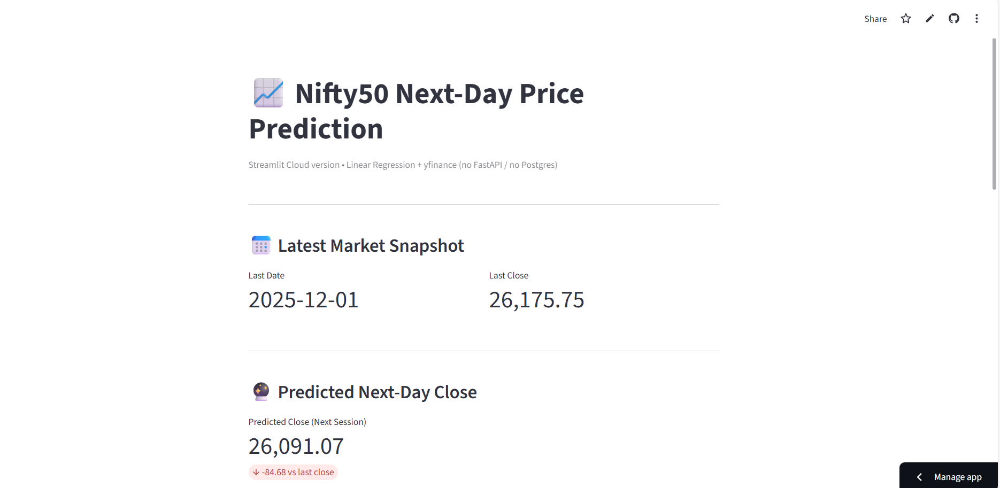

# 📈 Nifty50 Stop Prediction App

---

## 🚀 Overview  
An **end-to-end MLOps + Time Series prediction system** that:

- 📥 Ingests historical index data using :contentReference[oaicite:0]{index=0} from :contentReference[oaicite:1]{index=1}  
- 🧹 Cleans data into **Date, Close, High, Low, Open, Volume**  
- ⚡ Generates time-series features (lags, rolling volatility, moving averages, spreads, volume trends, trend signals, date parts)  
- 🗄 Loads feature store into :contentReference[oaicite:2]{index=2} (containerized)  
- 🤖 Trains **Linear Regression** with :contentReference[oaicite:3]{index=3} using **time-series-aware split (`shuffle=False`)**  
- 📊 Evaluates regression metrics (R², MAE, MSE, RMSE, sMAPE, MAPE, Bias, Residual diagnostics, Durbin-Watson, Max Error, etc.)  
- 🌐 Serves predictions using **REST API** built with :contentReference[oaicite:4]{index=4}  
- 🖥 Displays predictions & metrics on a **live frontend** using :contentReference[oaicite:5]{index=5}  
- ⛓ Orchestrates the entire pipeline using :contentReference[oaicite:6]{index=6} **DAG scheduled daily @ 6 PM IST**  
- 📦 Fully containerized using **🐳 Docker Compose**  
- 🧪 Enables experiment tracking via :contentReference[oaicite:7]{index=7} (**Future model registry scope included**)  

---

## 🛠️ Tech Stack

| Layer | Component |
|---|---|
| 📊 Data Engineering | pandas, NumPy |
| 💹 Data Ingestion | yfinance |
| 🧠 Feature Engineering | Lags, rolling std, MA5/MA20, HL diff, volume MA |
| 🤖 Machine Learning | scikit-learn |
| 🌐 API Layer | FastAPI + Uvicorn |
| 🖥 Frontend | Streamlit Dashboard |
| 🗄 Database | PostgreSQL (Dockerized Feature Store) |
| ⚙ Orchestration | Apache Airflow DAG |
| 🔍 Experiments | MLflow Tracking |
| 🧪 Testing | pytest (future scope) |
| 📦 Containerization | Docker & Docker Compose |
| 🧑‍💻 Code Hosting | :contentReference[oaicite:8]{index=8} |

---

## 📁 Project Structure

